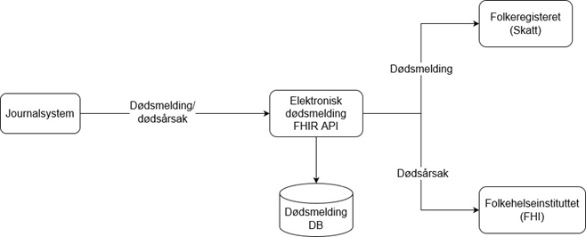

## Introduction
This project contains information for integration with the Norwegian [electronic death message system](https://www.fhi.no/hn/helseregistre-og-registre/dodsarsaksregisteret/elektronisk-dodsmelding/). The system ensures that information about the deaths is passed on to the relevant registries and authorities. The project is managed by Norsk Helsenett.

## Background
The primary purpose of the API is to enable integration for electronic health record (EHR) systems with the electronic death message system. The death message (dødsmelding) containing the identity and the death date of the deceased is validated and forwarded to the Norwegian tax office, while information about the cause of death (dødsårsaksmelding) is forwarded to FHI.

## [Use cases](./Use%20cases/UseCases.md)

## Contact
Utvikling-dodsmelding@nhn.no