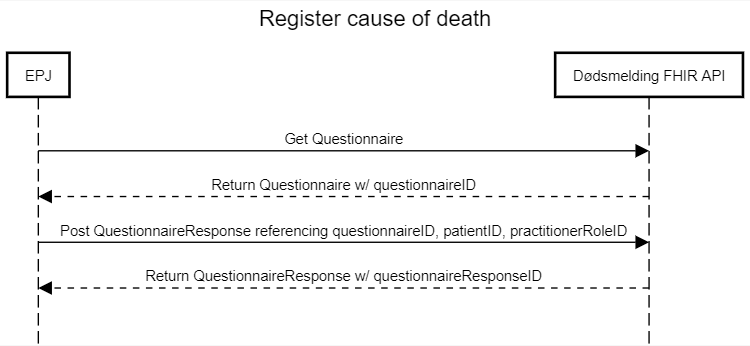
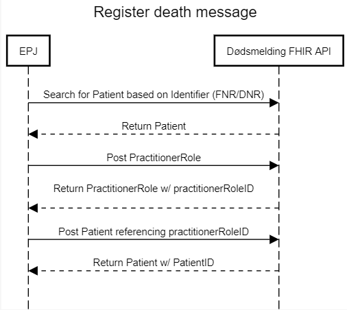

## Use cases

### Register death message
Sending a death message is initiated by searching for a Patient based on its identifier (either FNR or DNR), which will return a Patient object. 

Then, if a PractitionerRoleID for the registering user is not available, a PractitionerRole object with contact information should be posted to receive one.

Finally, the patient should be posted with a valid identifier, deceasedDate, and practitionerRoleID, which will send the information to the Norwegian tax office and return the Patient object including its PatientID.

### Register cause of death
Sending a cause of death message starts by calling a GET on the Questionnaire resource, which contains information about the questions and possible answers. 

The QuestionnaireResponse should contain the questionnaireID, patientID, practitionerRoleID. Posting it will send the answers to FHI, and return the same object with a questionnaireResponseID.

***
**Note**: The answerValueSet of the questions asking directly about cause of death is quite large (~22000 codes) and is frequently updated by FHI. It therefore refers to a separate endpoint which will return the ValueSet. 

***